# 730-splitter

Client-side web app that splits Italian **730-4 fornitura** files (`.rel`) into one file per **sostituto d'imposta** (tax withholding agent / employer). Upload a single combined `.rel`, download a ZIP containing the per-company files — all processing happens in the browser; nothing is sent to a server.

## Overview

Agenzia delle Entrate 730-4 submissions can bundle multiple employers in one XML file. This tool reads that file, groups `Documento_730-4` entries by sostituto, and produces separate `.rel` files ready for individual use. Output filenames follow the pattern `{CodiceFiscale}_{DenominazionePNF|Cognome}.rel`.

The UI is in Italian and is designed for accountants and payroll operators who need a quick, private way to split a fornitura without installing desktop software.

## How it works

```mermaid
flowchart LR
  A[Select .rel file] --> B[Read file in browser]
  B --> C[Parse XML]
  C --> D[Collect unique Sostituto keys]
  D --> E[For each sostituto]
  E --> F[Clone document]
  F --> G[Remove other Documento_730-4 blocks]
  G --> H[Update TotaleDocumenti]
  H --> I[Serialize to .rel]
  I --> J[Build ZIP with JSZip]
  J --> K[Download ZIP]
```



1. **File selection** — The user picks a `.rel` (or `.xml`) file via the file input. The file stays on the device.
2. **Parse** — `splitRelFile()` in `app.js` parses the XML with the browser's `DOMParser` and validates the root element is `Fornitura730-4` in the official M730 namespace.
3. **Identify sostituti** — Each `Documento_730-4` child is inspected for a `Sostituto` element. A unique key is built from `CodiceFiscale` plus either `DenominazionePNF` (legal entity) or `Cognome` (natural person via `DatiAnagraficiPF`).
4. **Split** — For every unique key, the full document is cloned. All `Documento_730-4` blocks belonging to other sostituti are removed. The `Intestazione/TotaleDocumenti` count is updated to match the remaining documents.
5. **Package** — Each output is serialized back to XML (with an XML declaration if missing) and added to a ZIP archive via [JSZip](https://stuk.github.io/jszip/) (loaded from CDN).
6. **Download** — The user downloads `{original-name}_output.zip` containing one `.rel` per sostituto.

Errors (invalid XML, wrong format, no sostituti found) are surfaced in the UI with Italian messages.

## Code layout

| Path                         | Role                                                                      |
| ---------------------------- | ------------------------------------------------------------------------- |
| `index.html`                 | Page structure, Italian copy, file input and action buttons               |
| `app.js`                     | Core splitting logic (`splitRelFile`) and DOM event wiring                |
| `styles.css`                 | Layout and styling                                                        |
| `tests/fixtures/`            | Minimal sample `.rel` files for automated tests                           |
| `tests/split-rel.test.mjs`   | Unit tests for splitting, naming, and error cases                         |
| `tests/setup-dom.mjs`        | Loads `app.js` in Node by polyfilling DOM APIs with `@xmldom/xmldom`      |
| `scripts/validate-local.mjs` | Optional local regression against real files in `test_data/` (gitignored) |
| `eslint.config.mjs`          | ESLint flat config (browser globals for `app.js`, Node for tests/scripts) |

`app.js` exports its core functions when required from Node (`module.exports`), so the same implementation is tested headlessly and runs in the browser without a build step.

### Local development

```bash
npm install
npm test              # run unit tests
npm run lint          # ESLint
npm run format:check  # Prettier
npm run ci            # lint + format check + test (same as CI)
npm run test:local    # optional regression if test_data/ exists locally
```

Open `index.html` in a browser (or serve the folder with any static file server) to use the app. No bundler or compile step is required.

## CI

GitHub Actions runs on every push and pull request (`.github/workflows/ci.yml`):

1. Checkout
2. Node.js 22 with npm cache
3. `npm ci`
4. `npm run lint` — ESLint
5. `npm run format:check` — Prettier
6. `npm test` — Node built-in test runner over `tests/**/*.test.mjs`

The `test:local` script is intentionally excluded from CI; it depends on developer-only `test_data/` and exits cleanly when that folder is absent.

## Credits

This project was developed with [Cursor](https://cursor.com).
